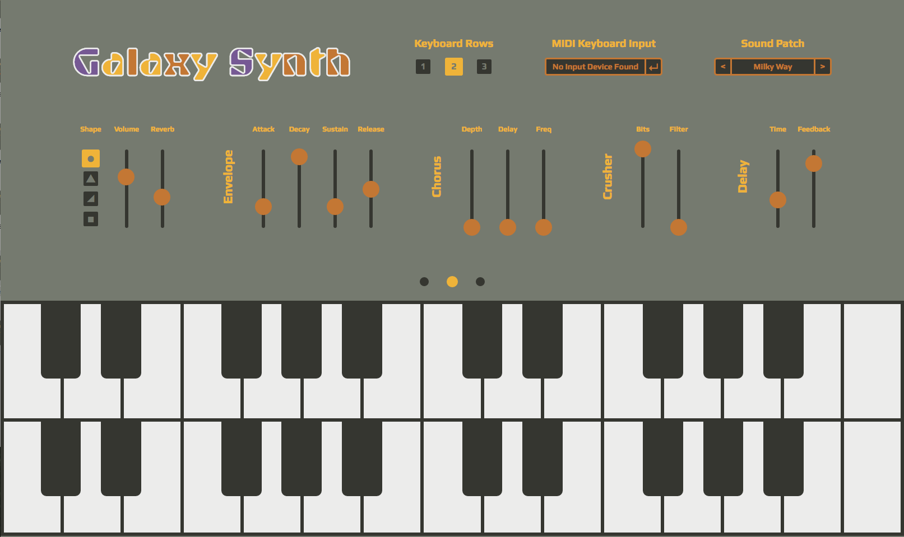

# Galaxy Synth

Plug in your MIDI keyboard and play! No need for an installed application to make music.

Galaxy Synth uses [Tone.js](https://github.com/Tonejs/Tone.js/) and [Web MIDI API](https://webaudio.github.io/web-midi-api/).

## Set Up

You can easily save your own sound patches if you set up the project locally.

After you clone the project just `npm install` and `npm start` to run the dev-server.

Make a new sound patch by navigating to `app/js/sounds.js`. Start by making new instances of the effects settings (the number value arguments range from 0 to 100 and represent the knob position on the control slider, eg: 0 is no volume, 100 is full volume). Here is the code for the 'Milky Way' sound patch.

`var master_MW = new MasterControls('sine', 65, 35);`
`var envelope_MW = new Envelope(30, 90, 20, 50);`
`var crusher_MW = new Crusher(100, 0);`
`var delay_MW = new Delay(35, 80);`
`var chorus_MW = new Chorus(0, 0, 0);`

Then make a new `ControlSettings` instance, passing the title of the sound patch as the first argument and the effects instances as the following arguments in the order shown.

`var milkyWay = new ControlSettings('Milky Way', master_MW, envelope_MW, crusher_MW, delay_MW, chorus_MW);`

Finally, add the `ControlSettings` instance to the `sounds` array.

`var sounds = [milkyWay, andromeda, triangulum, centaurus, sombrero, pinwheel, whirlpool];`

Now you will be able to find your sound in the Sound Patch control on the upper right of the screen.

## Technical

The connection between ToneJS and WebMIDI is handled by two event emitters: the tone-trigger and the controller.

The tone-trigger connects the synth.js file to the midi.js file. Tone-trigger causes a ToneJS [MonoSynth](https://tonejs.github.io/docs/#MonoSynth) to sound on a keydown, by adding the chosen tone to an available MonoSynth. There are eight possible MonoSynth instances, making the app an eight-voice polyphonic synthesizer. On a keyup WebMIDI event, the tone is released (ceases to sound) and removed from it's paired MonoSynth.

The controller connects the synth.js file to the controls.js file. It is fired whenever a change is made to any slider or control button. This causes all MonoSynths to update the effect or envelope filter variables, altering the sound output.
